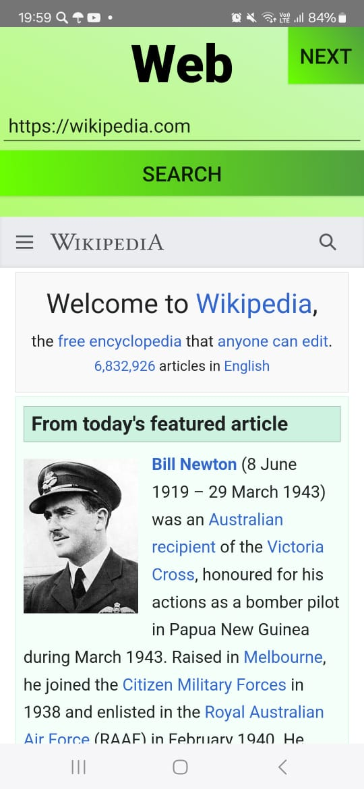
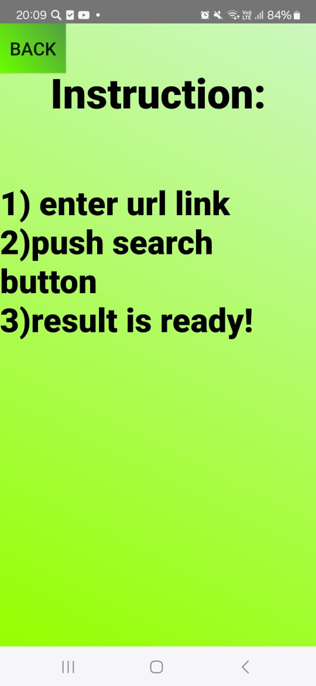

# Android-app-with-webview-widget
Приложение с виджетом webview. Для того чтобы найти сайт или браузер достаточно ввести url адрес, нажать кнопку и всё отобразится на виджете webview. Также есть второй экран на который можно перейти по нажатию кнопки

